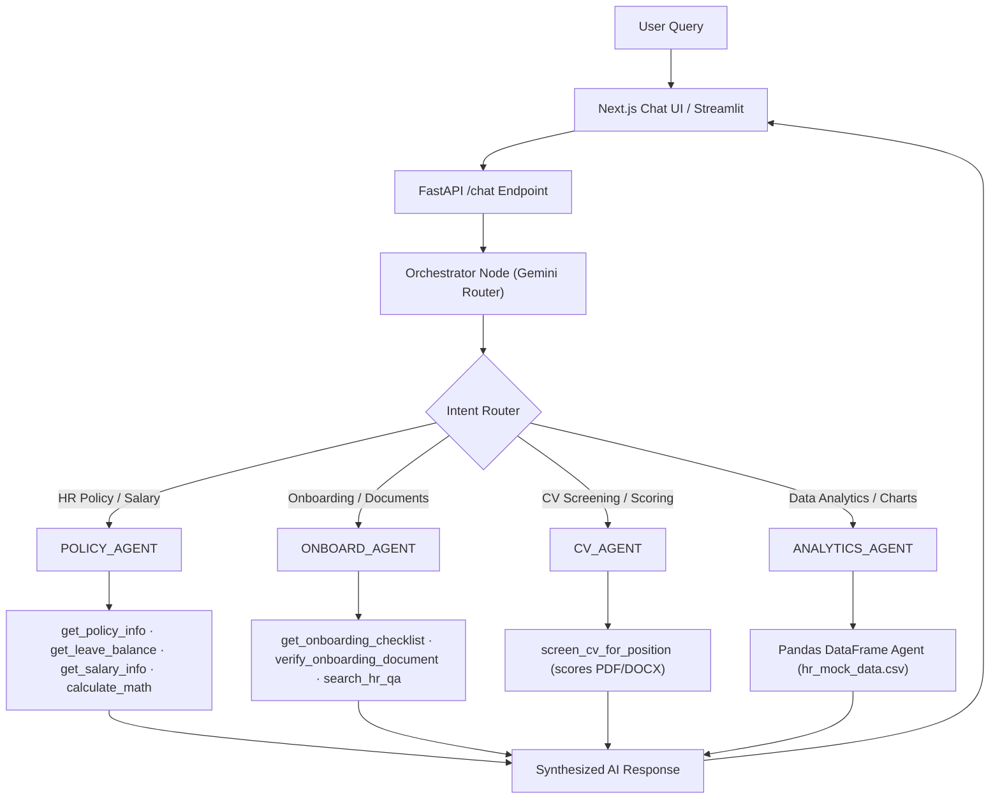

# Final Evaluation Report
## Paraline HR AI Agent (Pure Vector)

**Project:** `hr-ai-agent-pure-vector`
**Author:** Paraline Software
**Report Date:** 2026-03-05
**Evaluation Status:** ✅ Complete

---

## 1. Executive Summary

The **Paraline HR AI Agent** is an end-to-end autonomous HR assistant system built on a modern AI stack combining Python/FastAPI, LangGraph multi-agent orchestration, Google Gemini LLM, a Next.js frontend, and a Streamlit dashboard. The system intelligently routes employee and HR manager requests to four specialized AI agents, each equipped with dedicated tools for completing its domain-specific tasks.

The project demonstrates a well-structured, production-oriented approach to AI-powered HR automation, covering four key business domains: **HR Policy Q&A**, **Employee Onboarding**, **CV Recruitment Screening**, and **HR Data Analytics**.

---

## 2. Project Architecture Overview

### 2.1 System Stack

| Layer | Technology |
|---|---|
| **Frontend (Chat UI)** | Next.js 14 (React, TypeScript, TailwindCSS) |
| **Frontend (Dashboard)** | Streamlit (Python) |
| **Backend API** | FastAPI + Uvicorn |
| **Agent Orchestration** | LangGraph (StateGraph) |
| **LLM Provider** | Google Gemini (`gemini-1.5-flash`) |
| **Vector Database** | ChromaDB + Sentence Transformers |
| **Relational DB (Applicants)** | SQLite via SQLModel |
| **Data Analytics** | Pandas + LangChain Experimental |
| **CV Processing** | PyPDF2, python-docx |
| **Package Manager** | `uv` (Ultra-fast Python installer) |

### 2.2 Processing Pipeline



---

## 3. Module Evaluation

### 3.1 Orchestrator (`src/agents/orchestrator.py`)

**Status: ✅ Functional**

| Criteria | Assessment |
|---|---|
| Intent Classification | Uses Gemini LLM one-shot routing with keyword fallback |
| Agent Routing Accuracy | Clear prompt examples for all 4 domains (bilingual Vietnamese/English) |
| State Management | `AgentState` TypedDict carries `messages`, `next`, `user_intent`, `user_id`, `user_info` |
| Offline Resilience | Gracefully falls back to `OfflineAgent` when API key is absent |
| LangGraph Integration | Proper `StateGraph` with conditional edges and `ToolNode` per agent |

**Strengths:**
- Clean separation between orchestration logic and agent logic.
- Supports bilingual intent examples out of the box (Vietnamese + English).
- Offline mode is a production-ready safety net.

**Improvement Opportunities:**
- Agent routing is keyword-based (`if "POLICY" in response`); LLM could return an unexpected format not caught by fallback conditions.
- No retry/fallback logic if the LLM returns an unrecognized intent.

---

### 3.2 Policy Agent (`src/agents/policy_agent.py`)

**Status: ✅ Functional**

**Tools Available:**
- `get_policy_info` – Retrieves HR policy documents via RAG (ChromaDB)
- `calculate_leave_days` – Computes leave entitlement
- `search_hr_qa` – Searches the HR Q&A database
- `get_employee_profile` – Mock DB lookup (EMP001, EMP002, ...)
- `get_leave_balance` – Returns remaining leave days
- `get_salary_info` – Returns salary level and performance rating
- `calculate_math_expression` – LLM-powered math evaluation (tax, salary proration)

**Strengths:**
- Richest tool set of the four agents.
- Math tool allows accurate computations without LLM hallucination risk.
- Employee ID–aware ("tôi" → auto-fills user_id from state).

**Improvement Opportunities:**
- `EMPLOYEE_DATA` is a hardcoded in-memory dictionary (2 employees); should connect to a real HR database.
- No validation on employee_id format in tools.

---

### 3.3 Onboarding Agent (`src/agents/onboard_agent.py`)

**Status: ✅ Functional**

**Tools Available:**
- `get_onboarding_checklist` – Retrieves phase/week checklists for new employees
- `search_hr_qa` – Searches onboarding policy Q&A
- `verify_onboarding_document` – AI OCR validation of uploaded documents (CCCD, health certificates)

**Strengths:**
- AI OCR document verification is a differentiating feature for real HR workflows.
- Friendly, Vietnamese-first conversational tone.
- Employee Portal UI (Streamlit) provides a visual checklist tracker.

**Improvement Opportunities:**
- Document verification is simulated ("mock OCR"); integrating a real OCR service (Google Document AI, Tesseract) would make it production-ready.
- No persistent storage of onboarding completion status per employee.

---

### 3.4 CV Agent (`src/agents/cv_agent.py`)

**Status: ✅ Functional**

**Tools Available:**
- `screen_cv_for_position` – Reads PDF/DOCX CV files, scores them against job requirements from `job_requirements_config.json`, returns structured breakdown:
  - Required Skills (30 pts)
  - Preferred Skills (20 pts)
  - Experience (25 pts)
  - Education (15 pts)
  - Certifications (10 pts)
  - **Total: 100 pts**

**Strengths:**
- Transparent, multi-criteria scoring rubric.
- Uses `job_requirements_config.json` for flexible, easily-configurable job definitions.
- Outputs actionable recommendation (e.g., "Pass / Reject / Review").
- Email & calendar automation drafts interview invitations for passing candidates.

**Improvement Opportunities:**
- CV parsing is file-path based; a production system should accept uploaded file bytes via API.
- No batch processing endpoint to screen multiple CVs simultaneously.
- `applicants_db.json` is file-based; should migrate to the SQLite DB already set up.

---

### 3.5 Analytics Agent (`src/agents/analytics_agent.py`)

**Status: ✅ Functional**

| Criteria | Assessment |
|---|---|
| Data Source | `data/hr_mock_data.csv` |
| Query Interface | Natural language → Pandas `create_pandas_dataframe_agent` |
| LLM Backend | Gemini `gemini-1.5-flash` at `temperature=0.0` |
| Safety | `allow_dangerous_code=True` (sandboxed Python execution) |
| Offline behavior | Returns graceful Vietnamese error message if API key is missing |

**Strengths:**
- Natural-language-to-Pandas pipeline is highly flexible.
- Zero-temperature ensures deterministic data queries.
- Supports chart generation requests ("Vẽ biểu đồ...").

**Improvement Opportunities:**
- `allow_dangerous_code=True` is a security risk in production; should use a proper sandbox.
- Only supports one CSV file (hr_mock_data.csv); no multi-table join capability.
- No result caching for repeated identical queries.

---

## 4. API Layer Evaluation (`api/`)

**Status: ✅ Functional**

### Key Endpoints

| Endpoint | Method | Description |
|---|---|---|
| `/health` | GET | Health check — returns `{"status": "ok"}` |
| `/chat` | POST | Main multi-agent chat endpoint (routes to LangGraph) |
| `/applicants` | GET/POST | Manage job applicants |
| `/screening` | POST | Trigger CV screening pipeline |
| `/files` | POST | File upload (CV documents) |
| `/job-requirements` | GET/POST | Manage job requirement configurations |

**Strengths:**
- CORS fully open for local development (configurable for production).
- Lazy-loads the LangGraph graph (avoids import overhead until startup).
- Per-user in-memory conversation history for multi-turn context.
- SQLModel-based ORM for applicant data (type-safe and extensible).

**Improvement Opportunities:**
- Conversation history is entirely in-memory; server restart clears all sessions.
- No authentication/authorization layer (any `user_id` can be passed).
- API key can be passed in the request body (`ChatRequest.api_key`) but appears unused.

---

## 5. Frontend Evaluation

### 5.1 Next.js Chat UI (`frontend/`)

**Status: ✅ Functional**

- Modern React 18 + Next.js 14 App Router
- TypeScript throughout
- TailwindCSS for styling
- Chat UI at `/chat` renders Markdown responses
- Applicant application form at `/apply`
- Connects to FastAPI backend via `NEXT_PUBLIC_API_BASE` environment variable

### 5.2 Streamlit App (`streamlit_app.py`)

**Status: ✅ Functional**

- Multi-tab interface: HR Dashboard + Employee Portal
- HR Dashboard: Analytics, CV Screening management, Applicant lists
- Employee Portal: Onboarding checklist, document upload
- Acts as an alternative/legacy interface for HR managers

---

## 6. Data Layer Evaluation

| Component | Type | Description |
|---|---|---|
| `chroma_db/` | Vector Store | ChromaDB persisted store for HR policy RAG |
| `data/hr_mock_data.csv` | CSV | Mock HR analytics data (employees, departments, salaries) |
| SQLite (via SQLModel) | Relational DB | Applicants and screening results |
| `job_requirements_config.json` | JSON Config | 35KB+ of multi-position JD configurations |
| `applicants_db.json` | JSON File | Legacy applicant store (should migrate to SQLite) |
| `documents/` | Markdown | HR policy source documents for RAG indexing |

**Strengths:**
- Clear separation to different storage backends per use-case.
- ChromaDB enables fast semantic similarity search for policy RAG.

**Improvement Opportunities:**
- Dual applicant storage (`applicants_db.json` + SQLite) creates inconsistency risk.
- No data migration scripts.
- No vector DB re-indexing workflow for when policy docs are updated.

---

## 7. Code Quality Evaluation

| Category | Status | Notes |
|---|---|---|
| **Code Style** | ✅ Good | Black + Flake8 enforced via pre-commit hooks |
| **Type Hints** | ✅ Good | mypy configured; FastAPI/Pydantic models typed |
| **Pre-commit Hooks** | ✅ Configured | black, flake8, mypy, ruff in `.pre-commit-config.yaml` |
| **Docstrings** | ⚠️ Partial | Present on tools and some agents; missing on some utility functions |
| **Test Coverage** | ⚠️ Minimal | Test files exist (`tests/`) but most are empty stubs |
| **Error Handling** | ✅ Good | HTTP exceptions raised cleanly; agent errors trapped and logged |
| **Environment Config** | ✅ Good | `python-dotenv` + `config.py` abstraction; no secrets in code |
| **Offline Mode** | ✅ Good | `OFFLINE_MODE=true` env var bypasses all API calls cleanly |
| **Docker Support** | ✅ Present | `docker/` directory with Docker artifacts |

---

## 8. Security Assessment

| Risk | Severity | Mitigation Status |
|---|---|---|
| `allow_dangerous_code=True` in Analytics Agent | ⚠️ Medium | Acceptable for internal demo; **must** use sandboxing in production |
| CORS `allow_origins=["*"]` | ⚠️ Low–Medium | Development setting; restrict to specific domains in production |
| No API authentication on `/chat` | ⚠️ Medium | Any client can impersonate any `user_id`; add JWT/session auth |
| Hardcoded employee data in tools | ✅ Low Risk | Mock data only; no real PII |
| `.env` excluded in `.gitignore` | ✅ Good | API keys not committed to repository |

---

## 9. Strengths & Achievements

1. **🏗️ Clean Multi-Agent Architecture** — LangGraph graph cleanly separates orchestration from execution. Each agent is independently replaceable.
2. **🌐 Bilingual Support** — System handles Vietnamese and English seamlessly (system prompts, routing examples, and responses).
3. **🔌 Offline Mode** — The `OFFLINE_MODE` flag makes local development and testing possible without any API key or internet access.
4. **📊 Natural Language Analytics** — The Pandas agent enables non-technical HR staff to query HR data conversationally.
5. **📄 Transparent CV Scoring** — 5-criteria weighted rubric makes screening decisions explainable and auditable.
6. **⚡ Modern Dev Toolchain** — `uv` for dependencies, pre-commit hooks, mypy type checking, and Docker support reflect production-grade engineering practices.
7. **🖥️ Dual Frontend Strategy** — Next.js for end-users + Streamlit for HR managers provides appropriate UX for each audience.

---

## 10. Improvement Recommendations

### 🔴 High Priority (Production Blockers)

| # | Issue | Recommendation |
|---|---|---|
| 1 | No user authentication | Add JWT-based auth to `/chat` and all API endpoints |
| 2 | In-memory conversation history | Persist conversation sessions to Redis or SQLite |
| 3 | `allow_dangerous_code=True` | Use a proper Python sandbox (restricted exec environment) |
| 4 | Hardcoded mock employee data | Connect `employee_data_tools.py` to the SQLite DB or a real HR API |

### 🟡 Medium Priority (Quality Improvements)

| # | Issue | Recommendation |
|---|---|---|
| 5 | Minimal test coverage | Write unit tests for all tools and integration tests for agent nodes |
| 6 | Dual applicant storage (JSON + SQLite) | Migrate to SQLite exclusively; remove `applicants_db.json` |
| 7 | No vector DB re-indexing automation | Add a `scripts/reindex.py` script and trigger on document changes |
| 8 | Missing docstrings | Complete docstring coverage for all agent modules |

### 🟢 Low Priority (Enhancements)

| # | Issue | Recommendation |
|---|---|---|
| 9 | No batch CV screening | Add endpoint `POST /screening/batch` for multiple CVs |
| 10 | Analytics: single CSV only | Extend Analytics Agent to support multi-table SQL queries |
| 11 | No conversation export | Add endpoint to export conversation history per user |

---

## 11. Overall Evaluation Score

| Dimension | Score | Remarks |
|---|---|---|
| **Architecture Design** | 9/10 | Well-structured multi-agent LangGraph graph; clean separation of concerns |
| **Feature Completeness** | 8/10 | All 4 agent domains are implemented and functional |
| **Code Quality** | 7/10 | Good style enforcement; incomplete test coverage is main gap |
| **Security** | 5/10 | Acceptable for demo; multiple gaps for production deployment |
| **Scalability** | 6/10 | In-memory state and mock data limit production scalability |
| **UX / Frontend** | 8/10 | Modern Next.js UI + Streamlit dashboard covers all user personas |
| **Documentation** | 8/10 | README is thorough; `docs/` present; code docstrings partially complete |

### 🏆 Final Score: **7.3 / 10**

> **Verdict:** The Paraline HR AI Agent is a well-architected, fully functional HR automation prototype that demonstrates strong engineering discipline. The system successfully delivers multi-agent AI capabilities with bilingual support, clean API design, and a production-grade tool stack. The primary gaps — authentication, persistent state, test coverage, and real database integration — are typical blockers for moving from prototype to production and are straightforward to address.

---

## 12. Appendix: File Structure Reference

```
hr-ai-agent-pure-vector/
├── api/
│   ├── main.py                     ← FastAPI app, /chat endpoint, startup logic
│   └── routers/                    ← applicants, screening, files, job_requirements
├── src/
│   ├── agents/
│   │   ├── orchestrator.py         ← LangGraph StateGraph + Gemini router
│   │   ├── policy_agent.py         ← Policy Q&A + employee data agent
│   │   ├── onboard_agent.py        ← Onboarding checklist + OCR doc validation
│   │   ├── cv_agent.py             ← CV screening & scoring agent
│   │   ├── analytics_agent.py      ← Pandas DataFrame analytics agent
│   │   └── offline_agent.py        ← Fallback agent (no API key required)
│   ├── tools/
│   │   ├── employee_data_tools.py  ← Mock DB: profile, leave, salary
│   │   ├── policy_tools.py         ← RAG: get_policy_info, search_hr_qa
│   │   ├── cv_tools.py             ← CV scorer wrapper tool
│   │   ├── onboard_tools.py        ← Onboarding checklist tool
│   │   ├── onboard_validation_tools.py ← AI OCR document verifier
│   │   ├── math_tools.py           ← LLM math expression evaluator
│   │   └── email_calendar_tools.py ← Interview invitation drafting
│   ├── core/                       ← Config, LLM setup
│   ├── db.py                       ← SQLite init
│   └── db_models.py                ← SQLModel ORM models
├── frontend/                       ← Next.js 14 chat UI + application form
├── streamlit_app.py                ← HR Dashboard + Employee Portal (Streamlit)
├── cv_screening.py                 ← Core CV scoring logic (5-criteria rubric)
├── job_requirements_config.json    ← Job description configurations
├── data/hr_mock_data.csv           ← Mock HR analytics dataset
├── documents/                      ← HR policy Markdown files (RAG sources)
├── chroma_db/                      ← Persisted ChromaDB vector store
├── tests/                          ← Test stubs (partially implemented)
├── docker/                         ← Docker deployment files
└── requirements.txt                ← Python dependencies
```

---

*Report generated by Antigravity AI • Paraline HR AI Agent — Final Evaluation*
*Evaluation Date: 2026-03-05*
