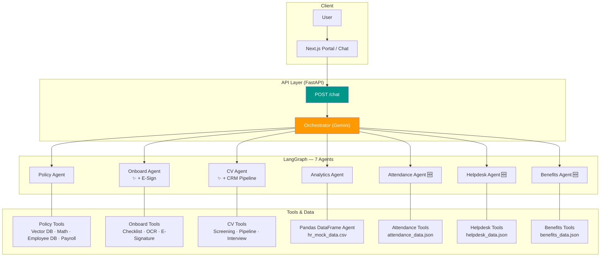

# Paraline HR AI Agent

Hệ thống **HR AI Assistant** đa tác nhân cho Paraline Vietnam — được xây dựng với Next.js frontend, Python/FastAPI backend và LangGraph orchestration. Tích hợp **11 module Odoo-inspired** giúp quản lý toàn bộ vòng đời nhân sự thông qua AI chatbot và giao diện web hiện đại.

[](https://www.python.org/downloads/)
[](https://fastapi.tiangolo.com)
[](https://nextjs.org)
[](https://python.langchain.com/)
[](https://ai.google.dev/)

---

## 🤖 Kiến Trúc Multi-Agent (7 Agents)

Orchestrator tự động phân tích intent và điều phối đến đúng agent:

```
User Query → Next.js UI → FastAPI → Orchestrator (Gemini)
                                          │
           ┌──────────┬──────────┬────────┼────────┬──────────┬──────────┐
           ▼          ▼          ▼        ▼        ▼          ▼          ▼
      POLICY      ONBOARD      CV    ANALYTICS ATTENDANCE HELPDESK BENEFITS
      AGENT       AGENT       AGENT    AGENT     AGENT     AGENT    AGENT
```

### 1. 📋 Policy Agent
- Trả lời câu hỏi chính sách HR qua RAG (Vector DB ChromaDB)
- Tra cứu thông tin cá nhân: số ngày phép, lương, hồ sơ nhân viên
- Xem **bảng lương chi tiết** (base salary, OT, thưởng KPI, khấu trừ, net salary)
- Tích hợp **AI Calculator** (LLMMathChain) tính lương, thuế, ngày công

### 2. 📝 Onboard Agent ✨
- Checklist onboarding theo giai đoạn (Tuần 1 → Tháng 3)
- **AI OCR** xác thực CCCD và tài liệu onboarding
- **E-Signature**: ký điện tử Hợp đồng LĐ, NDA, Thỏa thuận thử việc
- Xem và quản lý trạng thái tài liệu HR

### 3. 💼 CV Agent ✨
- Chấm điểm CV theo Job Description tự động
- **Recruitment CRM**: theo dõi pipeline tuyển dụng theo stage
- Lên lịch phỏng vấn + tạo Google Meet link
- Thống kê tuyển dụng tổng hợp

### 4. 📊 Analytics Agent
- Chat với database HR bằng ngôn ngữ tự nhiên
- Query `hr_mock_data.csv` qua Pandas DataFrame Agent
- Tính KPIs, vẽ biểu đồ phân bổ lương, headcount, turnover

### 5. 🕐 Attendance Agent 🆕
- Xem bảng chấm công tuần (check-in/out, OT hours)
- Nộp và theo dõi đơn nghỉ phép (Annual, Sick, Maternity…)
- Tính lương OT theo hệ số (x1.5 / x2.0 / x3.0)

### 6. 🎫 Helpdesk Agent 🆕
- Tạo HR Support Ticket (Equipment, Payroll, Benefits, IT…)
- Theo dõi trạng thái ticket theo SLA (4h → 7 ngày)
- Hiển thị lịch sử comments và giải pháp

### 7. 🎁 Benefits Agent 🆕
- Xem gói phúc lợi cá nhân: bảo hiểm, phụ cấp, training budget
- Duyệt catalog 3 gói bảo hiểm (Basic / Standard / Premium)
- Gửi yêu cầu thay đổi gói phúc lợi

---

## 🚀 Quick Start

### Yêu Cầu
- Python 3.10+, Node.js 18+
- [uv](https://github.com/astral-sh/uv) — Python package manager siêu nhanh
- Google Gemini API Key (hoặc bật `OFFLINE_MODE=true` để chạy offline)

### 1. Backend (FastAPI + LangGraph)

```bash
# Tạo môi trường ảo
uv venv
.venv\Scripts\activate          # Windows
# source .venv/bin/activate     # Mac/Linux

# Cài dependencies
uv pip install -r requirements.txt

# Tạo file .env
echo GOOGLE_API_KEY=your_gemini_key_here > .env
echo MODEL_NAME=gemini-1.5-flash >> .env
echo TEMPERATURE=0 >> .env
echo OFFLINE_MODE=false >> .env

# Khởi chạy server
uvicorn api.main:app --reload --host 0.0.0.0 --port 8000
```

### 2. Frontend (Next.js)

```bash
cd frontend
npm install
echo NEXT_PUBLIC_API_BASE=http://localhost:8000 > .env.local
npm run dev
```

---

## 🌐 Truy Cập

| URL | Chức năng |
|---|---|
| `http://localhost:3000` | Trang chủ Paraline |
| `http://localhost:3000/portal` | **HR Portal** — Hub điều hướng tất cả module |
| `http://localhost:3000/chat` | AI Chatbot HR |
| `http://localhost:3000/attendance` | Bảng chấm công & nghỉ phép |
| `http://localhost:3000/helpdesk` | HR Support Ticket |
| `http://localhost:3000/benefits` | Phúc lợi & bảo hiểm |
| `http://localhost:3000/notifications` | Thông báo nội bộ |
| `http://localhost:3000/payroll` | **💰 Bảng lương** — Xem lương, OT, thưởng, khấu trừ |
| `http://localhost:3000/hr-dashboard` | HR Analytics Dashboard |
| `http://localhost:3000/apply` | Form ứng tuyển |
| `http://localhost:8000/docs` | FastAPI Swagger Docs |

### Ví Dụ Query Chatbot

| Câu hỏi | Agent xử lý |
|---|---|
| `"Nghỉ phép còn lại của tôi (EMP001) là bao nhiêu?"` | Policy Agent |
| `"Lương tháng 3 của EMP001 là bao nhiêu?"` | Policy Agent |
| `"Cho tôi xem lịch sử lương 3 tháng của EMP002"` | Policy Agent |
| `"Tài liệu nào của tôi chưa ký?"` | Onboard Agent |
| `"Ký hợp đồng lao động cho EMP001"` | Onboard Agent |
| `"Đánh giá CV này cho vị trí ReactJS Developer"` | CV Agent |
| `"Pipeline tuyển dụng ReactJS đến stage nào rồi?"` | CV Agent |
| `"Mức lương trung bình Engineering là bao nhiêu?"` | Analytics Agent |
| `"Tuần này EMP001 làm mấy tiếng OT?"` | Attendance Agent |
| `"Tôi muốn nghỉ phép 10–12/03"` | Attendance Agent |
| `"Tạo ticket xin đổi laptop"` | Helpdesk Agent |
| `"Ticket TICK-2026-001 đang ở trạng thái nào?"` | Helpdesk Agent |
| `"Gói bảo hiểm của EMP001 gồm những gì?"` | Benefits Agent |
| `"Tôi muốn đổi gói bảo hiểm từ Basic lên Standard"` | Benefits Agent |

---

## 🗺️ Sơ Đồ Chi Tiết



---

## 📁 Cấu Trúc Dự Án

```
hr-ai-agent-pure-vector/
│
├── api/
│   ├── main.py                      ← FastAPI app + CORS + router registration
│   └── routers/
│       ├── applicants.py            ← CRUD ứng viên
│       ├── screening.py             ← CV screening results
│       ├── employees.py             ← Employee data
│       ├── attendance.py            ← 🆕 Check-in/out, leave requests
│       ├── helpdesk.py              ← 🆕 HR support tickets
│       ├── benefits.py              ← 🆕 Employee benefits
│       ├── notification.py          ← 🆕 HR announcements
│       └── payroll.py               ← 🆕 Bảng lương theo tháng
│
├── src/
│   ├── agents/
│   │   ├── orchestrator.py          ← LangGraph graph (7 agents, routing)
│   │   ├── policy_agent.py
│   │   ├── onboard_agent.py         ← ✨ + E-Signature, document mgmt
│   │   ├── cv_agent.py              ← ✨ + Recruitment CRM, interview scheduling
│   │   ├── analytics_agent.py
│   │   ├── attendance_agent.py      ← 🆕
│   │   ├── helpdesk_agent.py        ← 🆕
│   │   └── benefits_agent.py        ← 🆕
│   └── tools/
│       ├── policy_tools.py
│       ├── employee_data_tools.py
│       ├── onboard_tools.py
│       ├── onboard_validation_tools.py
│       ├── cv_tools.py
│       ├── email_calendar_tools.py
│       ├── math_tools.py            ← LLMMathChain (Gemini, temp=0)
│       ├── document_tools.py        ← 🆕 E-signature & document management
│       ├── attendance_tools.py      ← 🆕
│       ├── helpdesk_tools.py        ← 🆕
│       ├── benefits_tools.py        ← 🆕
│       ├── recruitment_tools.py     ← 🆕
│       ├── notification_tools.py    ← 🆕
│       └── payroll_tools.py         ← 🆕 Bảng lương AI tools
│
├── data/
│   ├── hr_mock_data.csv             ← HR analytics dataset
│   ├── attendance_data.json         ← 🆕 Check-in records, OT, leave requests
│   ├── helpdesk_data.json           ← 🆕 HR support tickets
│   ├── benefits_data.json           ← 🆕 Insurance packages, allowances
│   ├── recruitment_data.json        ← 🆕 Recruitment pipeline & interviews
│   ├── notifications_data.json      ← 🆕 Internal notifications
│   └── payroll_data.json            ← 🆕 Bảng lương 3 tháng (EMP001–EMP005)
│
├── documents/                       ← Knowledge Base (RAG sources)
│   ├── benefits_policy.md           ← 🆕 Chính sách phúc lợi
│   ├── attendance_policy.md         ← 🆕 Quy định chấm công & OT
│   ├── helpdesk_guide.md            ← 🆕 Hướng dẫn HR Helpdesk
│   ├── esignature_guide.md          ← 🆕 Quy trình ký điện tử
│   └── recruitment_process.md       ← 🆕 Quy trình tuyển dụng
│
├── frontend/                        ← Next.js 16 App Router
│   ├── app/
│   │   ├── portal/page.tsx          ← 🆕 HR Portal hub (điều hướng tất cả module)
│   │   ├── chat/page.tsx            ← AI Chatbot UI
│   │   ├── attendance/page.tsx      ← 🆕 Bảng chấm công & nghỉ phép
│   │   ├── helpdesk/page.tsx        ← 🆕 HR Support Ticket management
│   │   ├── benefits/page.tsx        ← 🆕 Phúc lợi & bảo hiểm
│   │   ├── notifications/page.tsx   ← 🆕 Thông báo nội bộ
│   │   ├── payroll/page.tsx         ← 🆕 Bảng lương (summary cards, breakdown, history)
│   │   ├── hr-dashboard/page.tsx    ← HR Analytics
│   │   └── apply/page.tsx           ← Form ứng tuyển
│   └── lib/
│       ├── api.ts                   ← API client (tất cả endpoints)
│       └── types.ts                 ← TypeScript types
│
├── requirements.txt
├── .env                             ← GOOGLE_API_KEY, OFFLINE_MODE, ...
└── README.md
```

---

## 🔌 API Endpoints

### Chat
| Method | Endpoint | Mô tả |
|---|---|---|
| `POST` | `/chat` | Gửi tin nhắn tới multi-agent system |

### Attendance 🆕
| Method | Endpoint | Mô tả |
|---|---|---|
| `GET` | `/attendance/{employee_id}` | Bảng chấm công tuần |
| `GET` | `/attendance/{employee_id}/leave-requests` | Danh sách đơn nghỉ |
| `POST` | `/attendance/leave-request` | Nộp đơn nghỉ phép |

### Helpdesk 🆕
| Method | Endpoint | Mô tả |
|---|---|---|
| `POST` | `/helpdesk/tickets` | Tạo ticket mới |
| `GET` | `/helpdesk/tickets/{ticket_id}` | Xem ticket |
| `GET` | `/helpdesk/tickets/employee/{id}` | Tickets theo nhân viên |
| `GET` | `/helpdesk/categories` | Danh mục & SLA |

### Benefits 🆕
| Method | Endpoint | Mô tả |
|---|---|---|
| `GET` | `/benefits/{employee_id}` | Phúc lợi nhân viên |
| `GET` | `/benefits/catalog` | Catalog gói phúc lợi |
| `POST` | `/benefits/change-request` | Yêu cầu thay đổi |

### Notifications 🆕
| Method | Endpoint | Mô tả |
|---|---|---|
| `GET` | `/notifications/{employee_id}` | Thông báo cá nhân |
| `POST` | `/notifications/send` | Gửi thông báo |
| `POST` | `/notifications/broadcast` | Công bố toàn công ty |
| `GET` | `/notifications/announcements/all` | Tất cả thông báo chung |

### Payroll 🆕
| Method | Endpoint | Mô tả |
|---|---|---|
| `GET` | `/payroll/{employee_id}` | Lịch sử lương toàn bộ |
| `GET` | `/payroll/{employee_id}/month/{YYYY-MM}` | Bảng lương tháng cụ thể |
| `GET` | `/payroll/summary/all` | Tổng hợp lương toàn công ty |

---

## 🤝 Đóng Góp

- Dùng `uv` để quản lý Python packages
- Python 3.10+, Node.js 18+
- Format code: Black (Python), Prettier (TypeScript)
- Lint: Flake8 / Ruff (Python), ESLint (TypeScript)

---

## 📄 License

MIT License — Dự án mã nguồn mở, tự do sử dụng và tùy chỉnh cho mục đích HR automation.

**Paraline Software • Japan Quality in Vietnam 🇯🇵🇻🇳**
