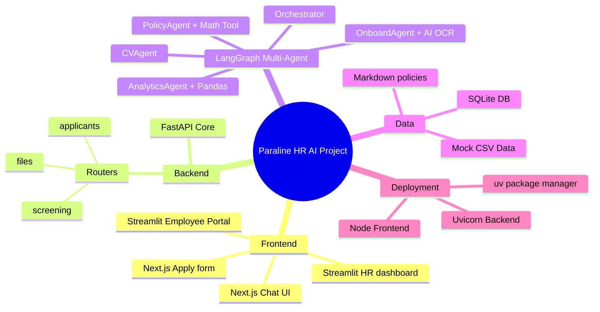
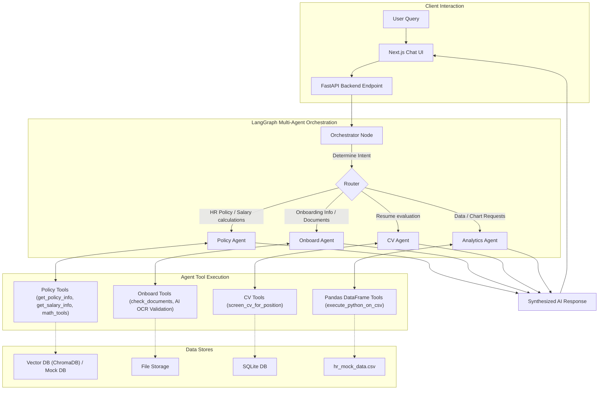

# Paraline HR AI Agent

This repository contains an end-to-end **Autonomous HR Assistant** built with a React/Next.js frontend and a Python/FastAPI backend using LangGraph. The system features multiple intelligent agents capable of answering HR policies, automating employee onboarding, scheduling interviews automatically, and running data analytics using Google Generative AI (Gemini).

[](https://www.python.org/downloads/)
[](https://fastapi.tiangolo.com)
[](https://nextjs.org)
[](https://python.langchain.com/)

---

## 🎯 Intelligent Modules

Paraline HR AI Assistant is powered by **LangGraph Multi-Agent Orchestration**:

### 1. Personalized Policy Q&A (`POLICY_AGENT`)
- Answers general HR policy questions using RAG (Vector DB).
- Retrieves personalized employee information (leave balance, salary info, profile) via Mock Database tools.
- Equipped with an AI `Calculator Tool` (powered by LLMMathChain) for exact mathematical calculations like prorated salary, tax deduction, and leave days.

### 2. Onboarding Automation (`ONBOARD_AGENT`)
- Employee Portal UI allows tracking 1st-week checklists and uploading documents.
- Includes **AI OCR Validation** which automatically mimics reviewing uploaded onboarding documents (Ex: ID Card, Health Certificate).

### 3. Recruitment Support (`CV_AGENT`)
- Auto-extracts resume scores based on Job Descriptions.
- **Email & Schedule Automation**: Automatically drafts professional interview invitation emails targeting specific candidates and creates simulated Google Meet links.

### 4. HR Analytics Agent (`ANALYTICS_AGENT`)
- Converse with your HR database in natural language!
- Automatically queries the `hr_mock_data.csv` to calculate statistics, find maximum salaries, layout headcount figures entirely via Python Sandbox (Pandas DataFrame Agent).

---

## 🚀 Quick Start

### Prerequisites
- Python 3.10+
- Node.js 18+
- [uv](https://github.com/astral-sh/uv) (Extremely fast Python package installer and resolver)
- API Keys for Google Gemini (Set `OFFLINE_MODE=true` in `.env` or leave the key blank if you want to run offline without an API key)

### 1. Setup Backend (FastAPI & LangGraph)

```bash
# 1. Create a virtual environment using uv
uv venv
# On Windows: .venv\Scripts\activate
# On Mac/Linux: source .venv/bin/activate

# 2. Install dependencies incredibly fast with uv
uv pip install -r requirements.txt
uv pip install langchain_experimental pandas # For Analytics Agent

# 3. Create .env config
# (Tip: Leave GOOGLE_API_KEY blank or set OFFLINE_MODE=true to use offline mock responses without calling Gemini API)
echo "GOOGLE_API_KEY=your_gemini_key_here" > .env
echo "MODEL_NAME=gemini-1.5-flash" >> .env
echo "TEMPERATURE=0" >> .env
echo "OFFLINE_MODE=false" >> .env

# 4. Start FastAPI server
uvicorn api.main:app --reload --host 0.0.0.0 --port 8000
```
*(The server will initialize the Orchestrator graph and database on startup).*

### 2. Setup Frontend (Next.js)

```bash
# 1. Change directory
cd frontend

# 2. Install Node dependencies
npm install

# 3. Setup environment pointing to backend
echo "NEXT_PUBLIC_API_BASE=http://localhost:8000" > .env.local

# 4. Start Next.js development server
npm run dev
```

### 3. Streamlit UI (Legacy/Dashboard Access)
If you want to view the HR Manager Dasboard or use the legacy Streamlit UI for CV Screening:
```bash
streamlit run streamlit_app.py
```

---

## 🌟 Accessing the App

Once both servers are running, access:
- **Landing Page:** `http://localhost:3000`
- **HR Chatbot (Next.js):** `http://localhost:3000/chat`
- **Employee Portal (Streamlit):** `http://localhost:8501/` (Tab My Onboarding)
- **HR Dashboard & CV Screening:** `http://localhost:8501/` (Tab HR Dashboard)

### Example Queries to ask the Chatbot:
* "Nghỉ phép còn lại của tôi (EMP001) là bao nhiêu?"* -> Routs to **Policy Agent**
* "CCCD upload lên đã hợp lệ chưa?"* -> Routs to **Onboard Agent**
* "Đánh giá cho tôi CV này để ứng tuyển ReactJS"* -> Routs to **CV Agent**
* "Mức lương trung bình của phòng Engineering là bao nhiêu?"* -> Routs to **Analytics Agent**

---

## �️ Project Pipeline Diagrams

To make the processing flow even clearer, here are two visualizations of the pipeline. The first is a high‑level mind map; the second is a detailed flowchart showing orchestration, query routing, and interaction flows.

### Mind Map Overview



### Detailed Processing Flow

This flowchart illustrates how user requests move through the system: intent evaluation, conditional routing, specific tool invocations based on agent context, and response synthesis.



---

## � System Architecture

```
hr-ai-agent-pure-vector/
│
├── README.md                        ← You are here
├── requirements.txt                 ← Python dependencies
├── .env                             ← Environment variables
│
├── api/
│   ├── main.py                      ← FastAPI application & Config setup
│   └── routers/                     ← API endpoints handling requests
│
├── src/
│   ├── agents/                      ← LangGraph orchestration & Agent logic
│   │   ├── orchestrator.py          ← Core router & Graph definition
│   │   ├── policy_agent.py
│   │   ├── onboard_agent.py
│   │   ├── cv_agent.py
│   │   └── analytics_agent.py
│   ├── tools/                       ← Extracted LLM Tools / Actions
│   │   ├── email_calendar_tools.py
│   │   ├── math_tools.py
│   │   ├── employee_data_tools.py
│   │   └── onboard_validation_tools.py
│   ├── core/                        ← LLM and App Configurations
│   ├── db.py                        ← Database configuration
│   └── db_models.py                 ← SQLModel declarations
│
├── frontend/                        ← Next.js 14 Web Application
│   ├── app/
│   │   ├── chat/page.tsx            <- Modern React-Markdown Chatbot UI
│   │   └── apply/page.tsx
│   └── package.json
│
├── data/                            ← Database files & hr_mock_data.csv
├── docs/                            ← Markdown sources for RAG knowledge base
└── streamlit_app.py                 ← Legacy Dashboard & Employee Portal UI
```

---

## 🤝 Contributing
Contributions are absolutely welcome!
- Use `uv` for python package management.
- Python 3.10+
- Use Flake8 for styling and Black for formatting.
- Check pre-commit hooks before committing: `pre-commit run --all-files`

---

## 📄 License
This project is licensed under the MIT License. Feel free to adapt or reuse it for your own HR automation efforts.

**Paraline Software • Japan Quality in Vietnam**
